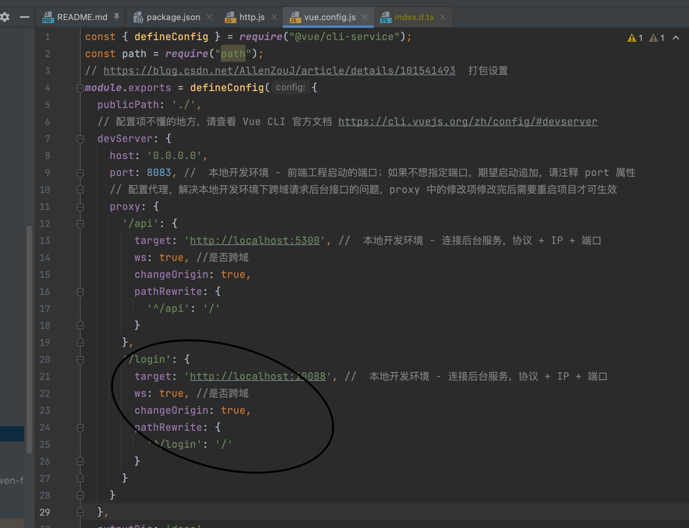

# 把公共类引入别的工程
      <dependency>
            <groupId>yun520.xyz</groupId>
            <artifactId>utils-common</artifactId>
            <version>1.0-SNAPSHOT</version>
        </dependency>
# swagger
整合Swagger-UI
## 添加项目依赖

在pom.xml中新增Swagger-UI相关依赖

~~~java
<!--Swagger-UI API文档生产工具-->
<dependency>
  <groupId>io.springfox</groupId>
  <artifactId>springfox-swagger2</artifactId>
  <version>2.7.0</version>
</dependency>
<dependency>
  <groupId>io.springfox</groupId>
  <artifactId>springfox-swagger-ui</artifactId>
  <version>2.7.0</version>
</dependency>
~~~
## 添加Swagger-UI的配置
添加Swagger-UI的Java配置文件

注意：Swagger对生成API文档的范围有三种不同的选择

生成指定包下面的类的API文档
生成有指定注解的类的API文档
生成有指定注解的方法的API文档
~~~java
package com.macro.mall.tiny.config;

import org.springframework.context.annotation.Bean;
import org.springframework.context.annotation.Configuration;
import springfox.documentation.builders.ApiInfoBuilder;
import springfox.documentation.builders.PathSelectors;
import springfox.documentation.builders.RequestHandlerSelectors;
import springfox.documentation.yun520.xyz.service.ApiInfo;
import springfox.documentation.spi.DocumentationType;
import springfox.documentation.spring.web.plugins.Docket;
import springfox.documentation.swagger2.annotations.EnableSwagger2;

/**
* Swagger2API文档的配置
  */
  @Configuration
  @EnableSwagger2
  public class Swagger2Config {
  @Bean
  public Docket createRestApi(){
  return new Docket(DocumentationType.SWAGGER_2)
  .apiInfo(apiInfo())
  .select()
  //为当前包下controller生成API文档
  .apis(RequestHandlerSelectors.basePackage("com.macro.mall.tiny.controller"))
  //为有@Api注解的Controller生成API文档
  //                .apis(RequestHandlerSelectors.withClassAnnotation(Api.class))
  //为有@ApiOperation注解的方法生成API文档
  //                .apis(RequestHandlerSelectors.withMethodAnnotation(ApiOperation.class))
  .paths(PathSelectors.any())
  .build();
  }

  private ApiInfo apiInfo() {
  return new ApiInfoBuilder()
  .title("SwaggerUI演示")
  .description("mall-tiny")
  .contact("macro")
  .version("1.0")
  .build();
  }
  }
~~~
## 用法
@ApiOperation："用在请求的方法上，说明方法的作用" value="说明方法的作用" notes="方法的备注说明"

@ApiImplicitParams：用在请求的方法上，包含一组参数说明
@ApiImplicitParam：对单个参数的说明	    
name：参数名
value：参数的说明、描述
required：参数是否必须必填
paramType：参数放在哪个地方
· query --> 请求参数的获取：@RequestParam
· header --> 请求参数的获取：@RequestHeader	      
· path（用于restful接口）--> 请求参数的获取：@PathVariable
· body（请求体）-->  @RequestBody User user
· form（普通表单提交）	   
dataType：参数类型，默认String，其它值dataType="Integer"	   
defaultValue：参数的默认值

# 如何上传一个图片流和信息


## rabbitmq
1、简单模式 HelloWorld
一个生产者、一个消费者，不需要设置交换机（使用 默认的交换机）

2、工作队列模式 Work Queue
一个生产者、多个消费者（竞争关系），不需要设置交换机（使用默认 的交换机）

3、发布订阅模式 Publish/subscribe
需要设置类型为fanout的交换机，并且交换机和队列进行绑定， 当发送消息到交换机后，交换机会将消息发送到绑定的队列

4、路由模式 Routing
需要设置类型为direct的交换机，交换机和队列进行绑定，并且指定routing key，当发送消息到交换机后，交换机会根据routing key将消息发送到对应的队列      ps  routing key是固定的


5、通配符模式 Topic
需要设置类型为topic的交换机，交换机和队列进行绑定，并且指定通配符方式的 routing key，当发送消息到交换机后，交换机会根据routing key将消息发送到对应的队列

ps  routing key可以模糊匹配
 rabbitmq 发送者 简单模式不加交换机；接收者则都是监听消息通道
~~~java
 @RabbitListener
 public void receive（String in）
 {
 System.out.println(in)
 }
~~~
## lcoaldate 转化为date
   ZoneId zoneId = ZoneId.systemDefault();
                LocalDateTime localDateTime = LocalDateTime.now();
                ZonedDateTime zdt = val.getCreateTime().atZone(zoneId);
                Date datefrom = Date.from(zdt.toInstant());
## git拒绝
git stash  
git pull --rebase
git pull 
## 多线程实践

  1自定义线程队列方便异常的时候把线程队列清空，线程池shutdown只会停止当前线程但是队列中的线程依然会执行，如果针对文件的多线程下载，需在异常后把队列清空
  LinkedBlockingQueue<Runnable> linkedBlockingQueue = new LinkedBlockingQueue<>();
   ExecutorService executorService = new ThreadPoolExecutor(3, 3,
                    0L, TimeUnit.MILLISECONDS,
                    linkedBlockingQueue);;
  this.executorService.shutdown();
  this.linkedBlockingQueue.clear();

  2 线程等待用CountDownLatch，子线程异常要把CountDownLatch减掉
  CountDownLatch countDownLatch = new CountDownLatch(userInfoList.get(0).getChunktotalnum());

while (this.latch.getCount() > 0) {
  this.latch.countDown();
  }
 3子线程异常没法向上抛出，设计理念就是线程的异常自己执行
 4 等待执行 wait必须放在synchronized里面。锁对象为synchronized锁对象

## 使用原型模式

控制层和服务层都需要加
@Scope(value = "prototype")
## 方法传参形式
    Long sAdd(String key, Object... values);
Object...values可变参数既可以用数组形式

## 创建


学习java开源线程池


## 分页
分页插件
两个都用于分页,常用的应该是PageHelper了，

使用方法是 PageHelper.startPage()然后后边写sql就可以。 紧接着的一个sql起作用。
IPage则需要在dao层传入IPage的实现类Page对象，该对象实现了IPage。
区别：
PageHelper内部原理是将传入的页码和条数赋值给了Page对象，保存到了一个本地线程ThreadLoacl中，然后会进入Mybatis的拦截器中。
然后再拦截器中获取本地线程中保存的分页的参数。最后再将这写分页参数和原本的sql以及内部定义好的sql进行拼接完成sql的分页处理。
中间会进行判断该sql 的类型是查询还是修改操作。如果是查询才会进入分页的逻辑并判断封装好的Page对象是否是null，null则不分页，否则分页。

IPage内部原理也是基于拦截器，但是这个拦截的是方法以及方法中的参数，这个也会判断是否是查询操作。如果是查询操作，才会进入分页的处理逻辑。
进入分页逻辑处理后，拦截器会通过反射获取该方法的参数进行判断是否存在IPage对象的实现类。如果不存在则不进行分页，存在则将该参数赋值给IPage对象。
然后进行拼接sql的处理完成分页操作。

## 开发登陆流程
### 先是获取密钥
https://console-docs.apipost.cn/preview/9ddee58a8a7409a8/fdafb47c24bd1a1a


### 关于 Spring Security OAuth2 中 CORS 跨域问题

> 结论试了最后也没用，最后在前端解决的
>
> 

@Order(-1)
配置 Spring Security 策略，不拦截 OPTIONS 请求
自定义 CorsFilter，设置 order 优先级比 Spring Security 的 order 高。
配置服务器允许 /oauth/token的 OPTIONS 方法，因为 /oauth/token 接口是先发一个 OPTIONS 请求，然后再发送 POST请求，如果是 OPTIONS 接口不被允许，就会返回 401 错误。
https://www.bbsmax.com/A/D854L3A25E/
@Configuration
@EnableWebSecurity
@EnableGlobalMethodSecurity(prePostEnabled = true)
@Order(-1)
public class WebSecurityConfiguration extends WebSecurityConfigurerAdapter {

    @Override
    protected void configure(HttpSecurity http) throws Exception {
//        http.requestMatchers().antMatchers(HttpMethod.OPTIONS, "/oauth/**","/login/**","/logout/**")
//            .and()
//            .authorizeRequests()
//            .antMatchers().permitAll()
//            .and()
//            .formLogin().permitAll(); //新增login form 支持用户登录及授权

            http.requestMatchers().antMatchers(HttpMethod.OPTIONS, "/oauth/**")
                    .and()
                    .cors()
                    .and()
                    .csrf().disable();
    }
}

## ouath2.0

### 资源服务器配置

 0 maven配置

~~~
<!--        springsecurity-->
        <dependency>
            <groupId>org.springframework.cloud</groupId>
            <artifactId>spring-cloud-starter-oauth2</artifactId>
        </dependency>
        <dependency>
            <groupId>org.springframework.cloud</groupId>
            <artifactId>spring-cloud-starter-security</artifactId>
        </dependency>
        <dependency>
            <groupId>org.springframework.boot</groupId>
            <artifactId>spring-boot-starter-web</artifactId>
        </dependency>
        <dependency>
            <groupId>io.jsonwebtoken</groupId>
            <artifactId>jjwt</artifactId>
            <version>0.9.0</version>
        </dependency>

~~~


 1开启配置

~~~


开启http安全访问
 */

@Configuration
//开启资源服务器
@EnableResourceServer
//@AllArgsConstructor
//@EnableGlobalMethodSecurity(prePostEnabled = true)
public class ResourceServerConfig extends ResourceServerConfigurerAdapter {
     //  这些是读取的配置文件配置，不然也可以手动注入

    //这里配置哪些请求允许访问
    @Override
    public void configure(HttpSecurity http) throws Exception {
        http.authorizeRequests()
                .anyRequest()
                .authenticated()
                .and()
                .csrf().disable()     // 前后端分离下，可以关闭 csrf
                .requestMatchers()
                //管理哪些接口
                .antMatchers("/user/**","/file/**","/web/**")
        ;
    }

}
~~~

2yml配置认证服务器和资源服务器的配置

~~~
#配置文件注入也可以在代码里注入
# clientId：OAuth2客户端的ID。
# clientSecret：OAuth2客户端的密钥。
# accessTokenUri：OAuth2授权服务器的令牌端点URL。
# userAuthorizationUri：OAuth2授权服务器的授权端点URL。
# scope：OAuth2客户端请求的范围。
oauth2-server-url: http://localhost:10088
security:
 oauth2: #与oauth2-server对应的配置
  client:
#   OAuth2客户端的ID。在认证服务器配置过
   client-id: read
   client-secret: read
   user-authorization-uri: ${oauth2-server-url}/oauth/authorize
   access-token-uri: ${oauth2-server-url}/oauth/token
  resource:
   token-info-uri: ${oauth2-server-url}/oauth/check_token
   id: ${spring.application.name}  # 资源id，可能存在多个资源服务器，可以配置客户端拥有哪些资源的访问权限

~~~


### 资源服务器访问认证服务器获得用户信息

> 应为在资源服务器获取用户信息是空值，且不知道为什么是空值现在的方案就是拿着头的节点信息去认证服务获取用户信息，应为同样的方法去认证服务器就能获取值

认证服务器方法
```
    @GetMapping("/getUserInformation")
    public User getUserInformation() {
        User user =(User) SecurityContextHolder.getContext().getAuthentication().getPrincipal();
        return user;
    }
}
```
资源服务器方法通过feign调用认证服务器

```
package yun520.xyz.service;

import org.springframework.cloud.openfeign.FeignClient;
import org.springframework.security.core.Authentication;
import org.springframework.web.bind.annotation.GetMapping;
import org.springframework.web.bind.annotation.PostMapping;
import org.springframework.web.bind.annotation.RequestHeader;
import org.springframework.web.bind.annotation.RequestParam;

@FeignClient("YDBSPACEUSER")
//FeignClient 微服务名
public interface LoginService {
    @GetMapping("/user/login")
//    ，如果发送的是get请求，那么需要在请求参数前加上@RequestParam注解修饰，Controller里面可以不加该注解修饰。
     boolean login(@RequestParam("username")String username, @RequestParam("password") String password);
    @GetMapping("/user/getUserInformation")
    Object getUserInformation(@RequestHeader("Authorization") String Authorization);


}
```

```
Object principal2 = SecurityContextHolder.getContext().getAuthentication();
loginService.getUserInformation("22");
```
myatisplus
deletebyid

    @TableId("userFileId")
    private int userFileId;
## gtihubcicd部署
> 参考 12
https://blog.csdn.net/weixin_43461520/article/details/127475965
语雀也有我自己写的